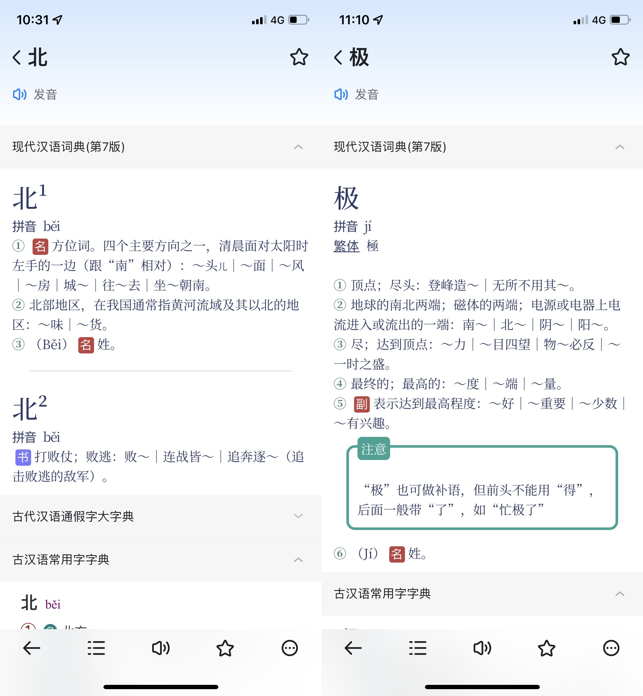
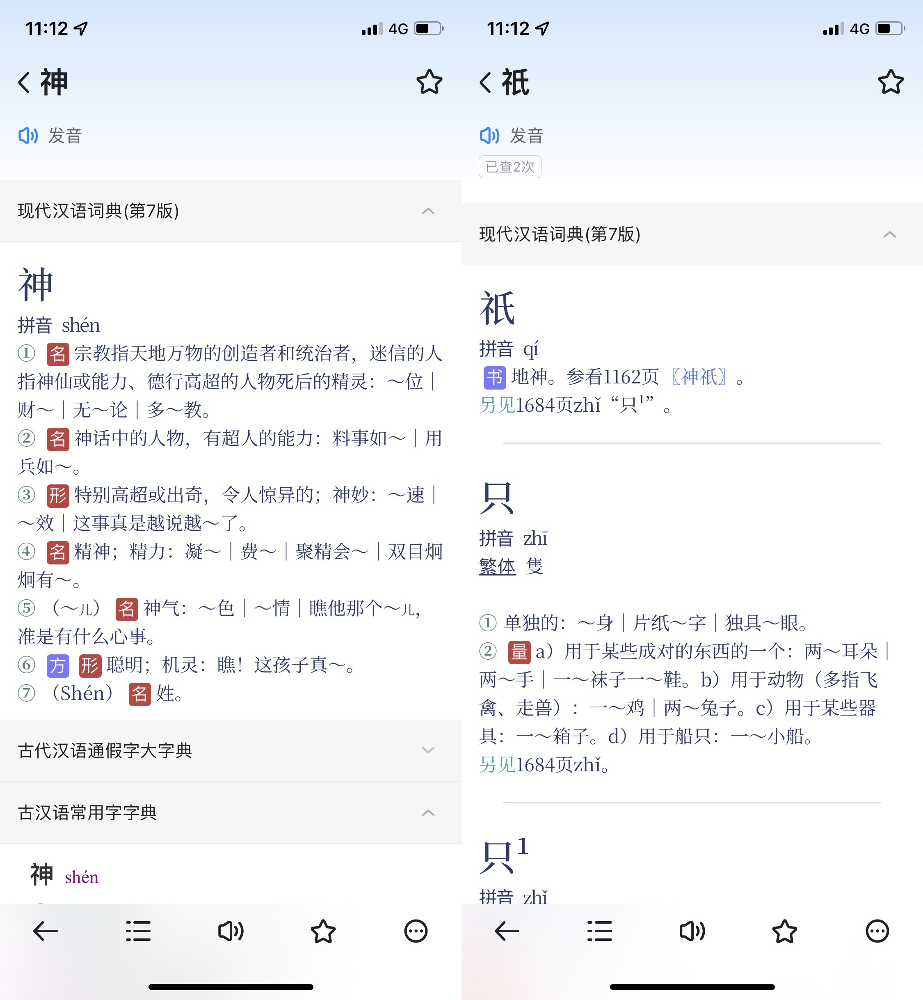
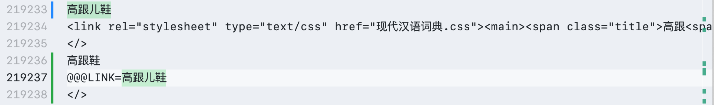
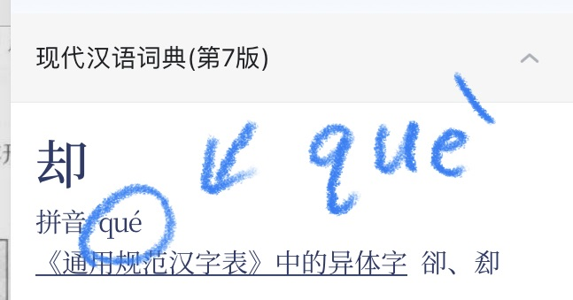
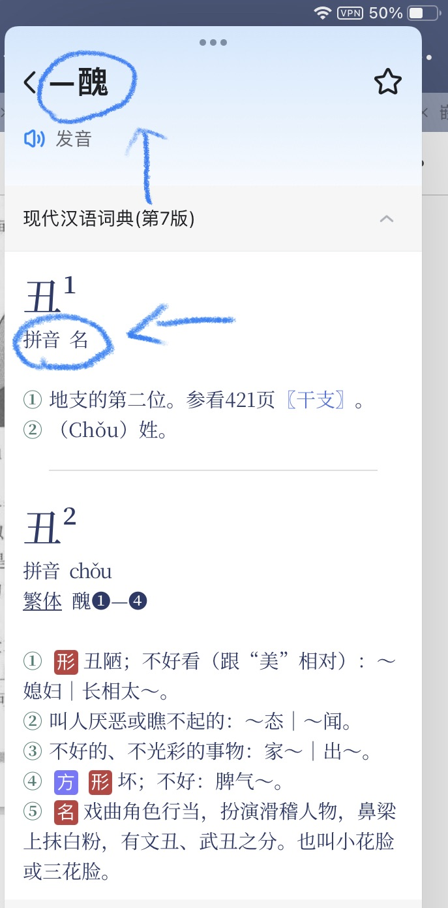
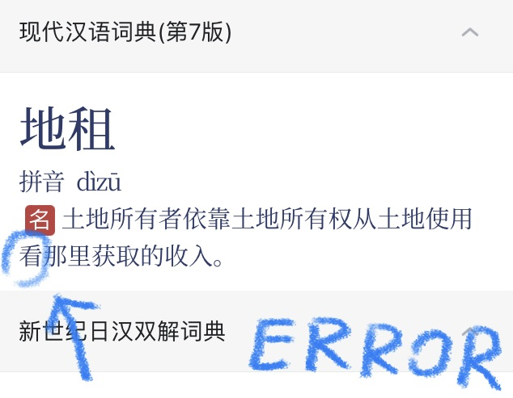
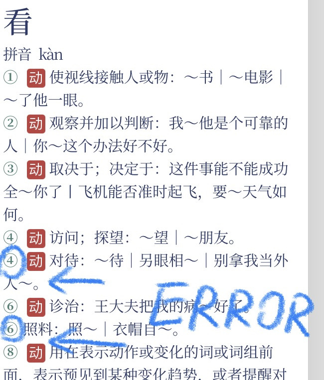
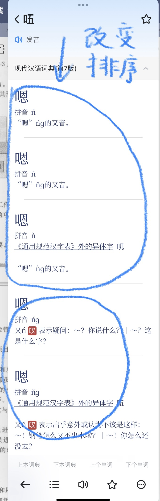

# ModernChineseDict

简约、美观的《现代汉语词典》第 7 版 mdict/mdx 资源。


## 介绍 | Introduction

重新设计的《现代汉语词典》第 7 版的 mdict/mdx 资源，可以被用在 **欧路词典** 等软件，以便快速高效、舒适地查阅文字、词语。

>   **请特别关注**
>
>   此资源仅供学习和交流，禁止商用，请务必于下载试用后 24 小时内删除。若阁下觉得《现代汉语词典》很不错，也请尽可能地支持官方 App。《现代汉语词典》官方 App 下载地址：[iOS/iPad](https://apps.apple.com/cn/app/%E7%8E%B0%E4%BB%A3%E6%B1%89%E8%AF%AD%E8%AF%8D%E5%85%B8-%E4%B8%80%E9%83%A8%E4%B9%85%E4%BA%AB%E7%9B%9B%E8%AA%89%E7%9A%84%E8%A7%84%E8%8C%83%E6%80%A7%E8%AF%8D%E5%85%B8/id1330896529)，[Android](https://www.baidu.com/s?wd=现代汉语词典%20app&rsv_spt=1&rsv_iqid=0xa15bc0f100284206&issp=1&f=8&rsv_bp=1&rsv_idx=2&ie=utf-8&rqlang=cn&tn=baiduhome_pg&rsv_enter=1&rsv_dl=tb&oq=%25E7%258E%25B0%25E4%25BB%25A3%25E6%25B1%2589%25E8%25AF%25AD%25E8%25AF%258D%25E5%2585%25B8&rsv_btype=t&inputT=1665&rsv_t=4ed3WInyiVHfyLHQdrQ9UMUq1UkHCaoAiPCpSZ%2FnTDNiJhFc7Kwwf5AwgcFpxorEZdMX&rsv_sug3=37&rsv_sug1=11&rsv_sug7=100&rsv_pq=aef584900022b4f3&rsv_sug2=0&rsv_sug4=1717)。

### 预览截图 | Preview Snapshots






在看了 freemdict.com 论坛的 [Quantus](https://forum.freemdict.com/u/Quantus) 大佬的帖子 [现代汉语词典第7版-2022.02.02](https://forum.freemdict.com/t/topic/4445) 后，恰好我也对汉语言有着比较浓烈的兴趣，遂决定和 TA 共同完善这部尚且还存在问题的词典。

>   为什么要校正词典？
>
>   此词典最初是直接由纸质词典经过光学字符识别而来的，所以错误是难免的。
>
>   如果阁下发现了错误或者值得优化之处，请直接向此仓库提出问题（Open an Issue）以便我们能以最快的速度处理。

### 关于美化样式、文件重构

-   采用免费开源、精致美观的**思源宋体**。经过精心设计的宋体被用作大面积显示汉语言，赋予词典以独特的古典气息。

-   采用全新色彩。好看的色彩是一切优秀排版的基石。经过全新设计的色彩赋予词典以新鲜的活力、舒适的观感。

-   将 mdx（实质是 html 集合文件）中，位于拼音标签内部的繁体字移至外部，使排版更合理。

-   ……

### 关于校订词典

-   校正大量错误的拼音。

-   校正部分光学识别错误的文字。

-   册除部分已从《现代汉语词典》第7版移除的词条。

-   调整某些字词的不同词条顺序，使其重要内容优先显示，以减少使用者查阅时间。

-   删除儿化音词头的 `<span class="er">儿</span>`，以避免查阅时出现不该出现的 HTML 标签。

    >   具体做法
    >
    >   将在中间含有儿话音的 **词头**复制两份，删除词头的 `<span class="er">儿</span>`，一份再在词头添上「儿」，建立重定向链接指向另一份，以确保不管有没有「儿」都可以查到该词。具体效果见下。

    

-   ……

## 开发配置

### 打包与解包

>   ⚠️
>
>   你需要先使用 pip 安装 [mdict-utils](https://github.com/liuyug/mdict-utils) 才能进行以下操作。

[mdict-utils](https://github.com/liuyug/mdict-utils) 安装命令：

```Shell
pip install mdict-utils
```

#### 解包到 mdx 文件夹

```Shell
mdict -x dict.mdx -d ./mdx
```

#### 打包到 dict.mdx

```
mdict --title mdx/dict.mdx.title.html --description mdx/dict.mdx.description.html -a mdx/dict.mdx.txt dict.mdx
```


### 使用到的工具

-   [mdict-utils](https://github.com/liuyug/mdict-utils) - 打包、解包 mdx 文件。
-   VS Code - 编辑、处理文本与代码。


## 贡献列表 | Contribution List

-   商务印书馆 - 出版 《现代汉语词典》。
-   Quantus - for making, polishing, and revising mdict.
-   Fibert Loyee（我，Me） - for beautifying and revising mdict.
-   欧路词典 - for providing pretty dict app.
-   Adobe - for providing pretty font: **Source Han Serif**.
-   ......

## 更新记录 | Update Logs

### 20220227 更新日志

#### 删除词条

-   [x] 缏子 (现汉5)
-   [x] 暴露文学（现汉5）
-   [x] 比例税制（现汉5）
-   [x] 不可同日而语（现汉5）
-   [x] 不人道(现汉5)
-   [x] 不在乎(现汉5)
-   [x] 菜霸(现汉5)
-   [x] 代言人(现汉5)
-   [x] 单口相声(现汉5)
-   [x] 登山运动(现汉5)
-   [x] 牴(现汉5)
-   [x] 牴触(现汉5)
-   [x] 牴牾(现汉5)
-   [x] 电子图书(现汉5)
-   [x] 丁克家庭(现汉5)
-   [x] 丁税(现汉5)
-   [x] 对簿(现汉5)
-   [x] 耳朵底子(现汉5)
-   [x] 番菜(现汉5)
-   [x] 犯憷(现汉5)
-   [x] 赶不上(现汉5)
-   [x] 赶得上(现汉5)
-   [x] 塔 (拼音 da）
-   [x] 圪塔 （现汉5）
-   [x] 膈ɡè
-   [x] 膈应 （现汉5）
-   [x] 搆
-   [x] 搆陷(现汉5)
-   [x] 河汊子(现汉5)
-   [x] 红教(现汉5)
-   [x] 欢声(现汉5)
-   [x] 黄教(现汉5)
-   [x] 人儿(现汉5)
-   [x] 容光(现汉5)
-   [x] 谁谁(现汉5)
-   [x] 穗状花序(现汉5)
-   [x] 谿壑(现汉5)
-   [x] 谿卡(现汉5)
-   [x] 谿刻(现汉5)
-   [x] 斩假石(现汉5)
-   [x] 活罪(现汉5)
-   [x] 火酒(现汉5)
-   [x] 兼听(现汉5)
-   [x] 脚盆(现汉5)
-   [x] 接力赛跑(现汉5)
-   [x] 开房间(现汉5)
-   [x] 框图（现汉5）
-   [x] 郎猫(现汉5)
-   [x] 木船(现汉6)
-   [x] 木筏(现汉5)
-   [x] 奶疮(现汉5)
-   [x] 飘尘(现汉5)
-   [x] 球儿(现汉5)
-   [x] 睁眼瞎子(现汉5)
-   [x] 高跟儿鞋(现汉5)
-   [x] 乳浊液(现汉5)
-   [x] 魑魅魍魉(现汉2)
-   [x] 八字帖儿(现汉5)
-   [x] 半托(现汉5)
-   [x] 切肤之痛(现汉5)
-   [x] 切骨之仇(现汉5)
-   [x] 矮半截(现汉5)
-   [x] 牓(现汉5)
-   [x] 獘(现汉5)
-   [x] 盋(现汉5)
-   [x] 詧(现汉5)
-   [x] 椉(现汉5)
-   [x] 箠(现汉5)
-   [x] 旾(现汉5)
-   [x] 剉(现汉5)
-   [x] 搤(现汉5)
-   [x] 飜(现汉5)
-   [x] 彿(现汉5)
-   [x] 髴(现汉5)
-   [x] 瓌(现汉5)
-   [x] 嘑(现汉5)
-   [x] 衚(现汉5)
-   [x] 椾(现汉5)
-   [x] 硷(现汉5)
-   [x] 痾(现汉5)
-   [x] 崑(现汉5)
-   [x] 挐(现汉5)
-   [x] 羴(现汉5)
-   [x] 旹(现汉5)
-   [x] 禩(现汉5)
-   [x] 𬘖(现汉5)
-   [x] 紬(现汉5)
-   [x] 䲡
-   [x] 鿃(现汉6)
-   [x] 〖U+E675〗(私用区字)：𮣲（U+2E8F2）
-   [x] 雰围(现汉5)
-   [x] 霍闪(现汉5)
-   [x] 忽米(现汉5)
-   [x] 不起眼儿(现汉5)
-   [x] 薯莨绸(现汉5)
-   [x] 西南非(现汉5)
-   [x] 撞骗(现汉5)
-   [x] 拷绸(现汉5)：《现汉7》改为“黑胶绸”。
-   [x] 跗蹠(现汉5)：《现汉7》改为“跗跖”。
-   [x] 公告牌(现汉5)
-   [x] 高枕(现汉5)
-   [x] 铜筋铁骨(现汉5)
-   [x] 偷奸取巧(现汉5)
-   [x] 不织布(现汉5)
-   [x] 花儿匠(现汉5)
-   [x] 紧身儿(现汉5)
-   [x] 𫎬 [Gàn]
-   [x] 𫏋 [<繁体>蹻
-   [x] 𥛱
-   [x] 謌
-   [x] 𬤐
-   [x] 䌷
-   [x] 鉏(chu2)
-   [x] 䌷绎(现汉5)
-   [x] 颿(𬳳 的索引)
-   [x] 𬳳
-   [x] 屹(ge1)
-   [x] 㟷
-   [x] 屹㟷(删除全条)
-   [x] 圪垯 (删除“适用于以上义项也作圪塔、屹㟷。”)
-   [x] 删除“㬊”（Hua4n），仅保留 Hua3n 声。
-   [x] 删除“䇲”(同“策”。)的整个词条，只保留 jia1 这个词条。
-   [x] 删除“俛”fǔ 读音的整个词条。
-   [x] 隣
-   [x] 的士 删除 di2shi4 这个读音的词条，仅保留 di1shi4 读音的词条。
-   [x] 删除 𬮤，以及与 𬮤 有关的部分引用：閤、合

#### 去除字头“儿”字的格式

-   [x] 𥅻盹儿

-   [x] 可可儿的

#### 修改词头

-   [x] 溟濛：溟蒙(《现汉5》规范词形为“溟濛”，《现汉7》改作“溟蒙”。)

-   [x] 打破沙锅问到底：打破砂锅问到底

-   [x] 板寸：板儿寸

-   [x] 下工夫：下功夫

-   [x] 褝(日本汉字)：{衤单}（是没问题的）

    >   注：褝 与 {衤单} 本质上是同一个字，前者为日文区域的字，后者为简中区域的字。
    >
    >   只不过大部分字体都默认将其作为日文字体显示。
    >   
    >   亲测 **思源宋体** 可正确显示此字符。

-   [x] 圪𫄤：纥𫄤

-   [x] 𫘧駬：𫘧𱅋

-   [x] 𫛸𫛞：𫛸𱉔

-   [x] 筹划(筹画)：加括号内字

-   [x] 刻画(刻划)：加括号内字

-   [x] 𨱑同“簧”。 -->𨱑旧同“簧”。

-   [x] 𥆧 [<繁体>𣋆：𥆧 [<繁体>瞤

-   [x] 𫄠 [<繁体>䋎：“𫄠” ->“𬘜”。

-   [x] 𫣊 [<繁体>𫣊：𫣊 [<繁体>僾

-   [x] 𬬱：增加繁体字“釿”。

-   [x] 𬭤：增加繁体字“鍭”。

-   [x] 㚢：人名用字——㚢：用于人名。(“人名用字”改成“用于人名”的，应该还有一些，没全改)

-   [x] 茜：人名用字——茜：用于人名。

-   [x] 㮾：蓈梨——㮾：㮾梨

-   [ ] 䩄：见903页〖腼腆〗。——䩄：见下。

    >   在无错误、无颠覆性改变的情况下，我们认为没必要对其进行任何修改。

    

#### 拼音错误

感谢 **择书库** 提出的提出的拼音错误

-   [x] 吧台 ba tái bā tái

-   [x] 吧嗒 bbā dā bā dā

-   [x] 八项规定 bā xiàng guīdÌng bā xiàng guī dìng

-   [x] 八下里 bā xià li bā xià lǐ

-   [x] 安营 ān yīng ān yíng

-   [x] 百分号 bǎi fēn háo bǎi fēn hào

-   [x] 斑蝥 bān móu bān máo

-   [x] 𨭉 bǎn bān

-   [x] 心传 xīin chuán xīn chuán

-   [x] 攒三聚五 zǎn sān jù wǔ cuán sān jù wǔ

-   [x] 下辈 xi bèi xià bèi

-   [x] 显摆 xiǎ bai xiǎn bai

-   [x] 化合价 nuà hé jià huà hé jià

-   [x] 时不时 shbù shí shí bù shí

-   [x] 恫瘝在抱 tōn guān zài bào tōng guān zài bào

-   [x] 真核生物 zhēng hé shēng wù zhēn hé shēng wù

-   [x] 畚箕 bēn jī běn jī

-   [x] 於乎 yū hū wū hū

-   [x] 於戏 yū hū wū hū

-   [x] 侥 yáo jiǎo

-   [x] 校雠 xiào chóu jiào chóu

-   [x] 驱散 qūn sàn qū sàn

-   [x] 㖞斜 wān xié wāi xié

-   [x] 枕边风 zhěng biān fēng zhěn biān fēng

-   [x] 扒灰 bá huī pá huī

-   [x] 酬谢 chou xiè chóu xiè

-   [x] 刺啦 cì lā cī lā

-   [x] 多少 duo shao duō shao (P336第二个)

-   [x] 如故 rù gù rú gù (P1110)

-   [x] 如果 rù guǒ rú guǒ (P1110)

-   [x] 悲切 bēi qiē bēi qiè (P54)）

-   [x] 北野 běi yē běi yě (P56)）

-   [x] 奔逝 bén shì bēn shì (P60)

| 奔突   | ban tū       | bēn tū (P60)       |
| :----- | :----------- | :----------------- |
| 本草   | bēn cǎo      | běn cǎo (P61)      |
| 崩龙族 | bèng lóng zú | bēng lóng zú (P64) |
| 迸发   | bèng fē      | bèng fā (P64)      |
| 比来   | bǐ lǎi       | bǐ lái (P67)       |
| 比丘尼 | bǐ qiū i ní  | bǐ qiū ní (P67)    |

| 比照   | bǐi zhào      | bǐ zhào (P68)              |
| :----- | :------------ | :-------------------------- |
| 笔记本 | bǐ jì bēn     | bǐ jì běn (P68)             |
| 闭关   | bǐ guān       | bì guān (P71)               |
| 闭门羹 | bì méng gēng  | bì mén gēng (P71)           |
| 庇护所 | bì hù suō     | bì hù suǒ (P71)             |
| 壁炉   | bù lú         | bì lú (P74)                 |
| 壁毯   | bì tàn        | bì tǎn (P74)                |
| 臂章   | bì zhǎng      | bì zhāng (P75)              |
| 承保人 | chéng bāo rén | chéng bǎo rén (P167)        |
| 作揖   | zuō yī        | zuò yī (P1757 书面语与口语) |

| 1. 秋闱    | qiū i wéi   | qiū wéi (P1073)    |
| :--------- | :---------- | :----------------- |
| 2. 生地1   | shē g dì    | shēng dì (P1167)   |
| 3. 消耗2   | xiāo à ao   | xiāo hào (P1436)   |
| 4. 刺棱    | cì lēng     | cī léng (P212)     |
| 5. 伯婆    | bà pó       | bó pó (P99)        |
| 6. 婚书    | hūn shì     | hūn shū (P588)     |
| 7. 校验    | xiào yàn    | jiào yàn (P658)    |
| 8. 劲歌    | jìn gē      | jìng gē (P693)     |
| 9. 脸膛儿  | jiǎn táng r | liǎn táng r (P812) |
| 10. 相距   | xiā ag jù   | xiāng jù (P1428)   |
| 11. 宵旰   | xiā ao gàn  | xiāo gàn (P1437)   |
| 12. 小儿   | xiǎ ér      | xiǎo ér (P1440)    |
| 13. 小拇哥 | xiǎ mu gē   | xiǎo mǔ gē (P1442) |
| 14. 消遁   | xiao dùn    | xiāo dùn (P1436)   |

#### 拼音缺失

-   [x] 𬘯 zhǔn
-   [x] 板² bǎn
-   [x] 辟 pī

#### 其他错误

>   -   [x] 20220219 @[KingRayCao](https://forum.freemdict.com/u/KingRayCao)
>
>   楼主辛苦了！几个错误：
>   佛戾 fó->fú
>   肖像 xiāo->xiào
>   人殓->入殓(拼音错误)

>   -   [x] 20220222  @[alexpeng](https://forum.freemdict.com/u/alexpeng)
>
>   楼主辛苦了。
>   拼音1处：罾 zènɡ → zēng
>   繁体1处：颜（顏）→ （顔）

>   -   [x] 20220211 @[shaoshi](https://forum.freemdict.com/u/shaoshi)    我改的时候可能已经被修复了
>
>   兄台之细心令人佩服，不过改拼音挺困难，这一条需要再改：显摆 xiǎ bai xiǎn bǎi
>
>   显摆 [xiǎn·bai]


### 20220228 更新日志

#### 词条内容错误与修正

-   却拼音错误



-   修复：「醜」词条名称多了破折号、拼音实际显示的是其 **词性**。



-   「地租」词条，「使用**看**」修改为「使用**者**」。



-   「看」词条，义项序号部分错误的问题。



-   「嗯」词条顺序改变，将有实际含义的词条移到首位。



### 20220301 更新日志

全面采用 **思源宋体** 作为主要显示字体。使用 **思源宋体** 显示后的字典将给人一种焕然一新、精致的感觉。

新的字体在 iOS、iPadOS、macOS 上测试通过，但在 Android 上暂未生效，具体原因还在排查。


### 20220302 更新日志

1.   感谢 freemdict 论坛用户 [择书库](https://forum.freemdict.com/u/择书库) 纠正拼音。

​	更改如下：

| **矰**   | **zèng**        | **zēng**        |
| -------- | --------------- | --------------- |
| 卓识     | zhuō shí        | zhuó shí        |
| 卓异     | zhuō yì         | zhuó yì         |
| 夹肝     | jiá gān         | jiā gān         |
| 节欲     | jiē yù          | jié yù          |
| 惊世骇俗 | jīn shì hài sú  | jīng shì hài sú |
| 看摊     | kàn tān         | kān tān         |
| 折受     | zhé shou        | zhé shòu        |
| 摔耙子   | shuā pá zi      | shuāi pá zi     |
| 涮锅子   | shuànɡ ɡuō zi   | shuàn ɡuō zi    |
| 肖像权   | xiāo xiàng quán | xiào xiàng quán |

2.   去除 **词头** 儿化音的 HTML 标签 span 格式
     -   可可儿的
     -   可惜了儿的
     -   外面儿光
     -   白眼儿狼
     -   白楂儿
     -   破题儿第一遭
     -   羊肚儿手巾
     -   肝儿颤
     -   胳膊肘儿朝外拐
     -   葱心儿绿
     -   街面儿上
     -   豆瓣儿酱
     -   蹦蹦儿戏
     -   跑堂儿的
     -   透心儿凉
     -   针尖儿对麦芒儿
     -   靠边儿站
     -   高跟儿鞋
3.   删除词条
     1.   𫘧
     2.   𫘧耳
     3.   𱅋
     4.   𣋆
4.   
