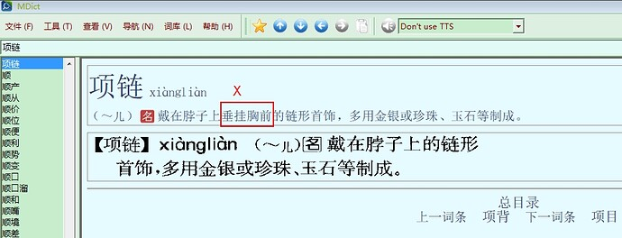
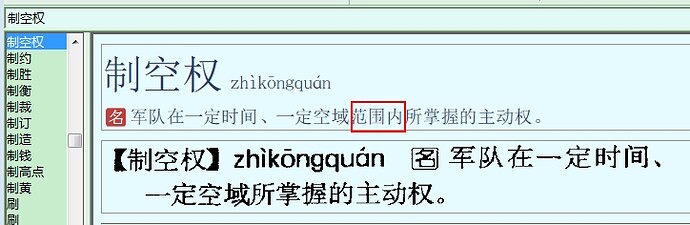
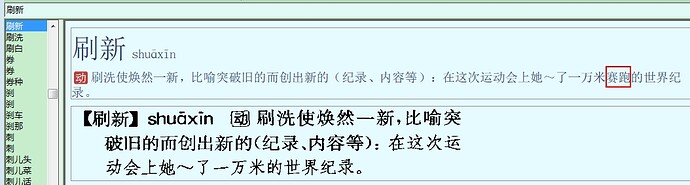
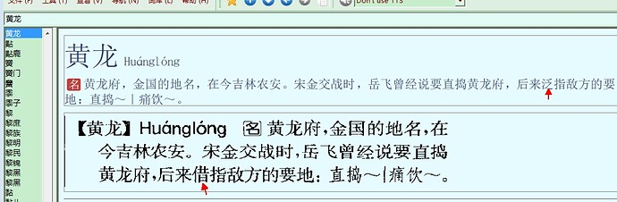
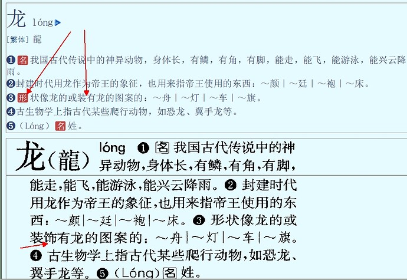
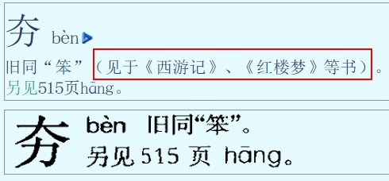
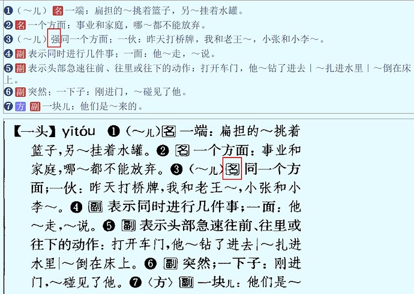

# ModernChineseDict

简约、美观的《现代汉语词典》第 7 版 mdict/mdx 资源。


## 介绍 | Introduction

重新设计的《现代汉语词典》第 7 版的 mdict/mdx 资源，可以被用在 **欧路词典** 等软件，以便快速高效、舒适地查阅文字、词语。

>   **请特别关注**
>
>   此资源仅供学习和交流，禁止商用，请务必于下载试用后 24 小时内删除。若阁下觉得《现代汉语词典》很不错，也请尽可能地支持官方 App。《现代汉语词典》官方 App 下载地址：[iOS/iPad](https://apps.apple.com/cn/app/%E7%8E%B0%E4%BB%A3%E6%B1%89%E8%AF%AD%E8%AF%8D%E5%85%B8-%E4%B8%80%E9%83%A8%E4%B9%85%E4%BA%AB%E7%9B%9B%E8%AA%89%E7%9A%84%E8%A7%84%E8%8C%83%E6%80%A7%E8%AF%8D%E5%85%B8/id1330896529)，[Android](https://www.baidu.com/s?wd=现代汉语词典%20app&rsv_spt=1&rsv_iqid=0xa15bc0f100284206&issp=1&f=8&rsv_bp=1&rsv_idx=2&ie=utf-8&rqlang=cn&tn=baiduhome_pg&rsv_enter=1&rsv_dl=tb&oq=%25E7%258E%25B0%25E4%25BB%25A3%25E6%25B1%2589%25E8%25AF%25AD%25E8%25AF%258D%25E5%2585%25B8&rsv_btype=t&inputT=1665&rsv_t=4ed3WInyiVHfyLHQdrQ9UMUq1UkHCaoAiPCpSZ%2FnTDNiJhFc7Kwwf5AwgcFpxorEZdMX&rsv_sug3=37&rsv_sug1=11&rsv_sug7=100&rsv_pq=aef584900022b4f3&rsv_sug2=0&rsv_sug4=1717)。

### 预览截图 | Preview Snapshots


在看了 freemdict.com 论坛的 [Quantus](https://forum.freemdict.com/u/Quantus) 大佬的帖子 [现代汉语词典第7版-2022.02.02](https://forum.freemdict.com/t/topic/4445) 后，恰好我也对汉语言有着比较浓烈的兴趣，遂决定和 TA 共同完善这部尚且还存在问题的词典。

>   为什么要校正词典？
>
>   此词典最初是直接由纸质词典经过光学字符识别而来的，所以错误是难免的。
>
>   如果阁下发现了错误或者值得优化之处，请直接向此仓库提出问题（Open an Issue）以便我们能以最快的速度处理。

### 关于美化样式、文件重构

-   采用免费开源、精致美观的**思源宋体**。经过精心设计的宋体被用作大面积显示汉语言，赋予词典以独特的古典气息。

-   采用全新色彩。好看的色彩是一切优秀排版的基石。经过全新设计的色彩赋予词典以新鲜的活力、舒适的观感。

-   将 mdx（实质是 html 集合文件）中，位于拼音标签内部的繁体字移至外部，使排版更合理。

-   ……

### 关于校订词典

-   校正大量错误的拼音。

-   校正部分光学识别错误的文字。

-   册除部分已从《现代汉语词典》第7版移除的词条。

-   调整某些字词的不同词条顺序，使其重要内容优先显示，以减少使用者查阅时间。

-   删除儿化音词头的 `<span class="er">儿</span>`，以避免查阅时出现不该出现的 HTML 标签。

    >   具体做法
    >
    >   将在中间含有儿话音的 **词头**复制两份，删除词头的 `<span class="er">儿</span>`，一份再在词头添上「儿」，建立重定向链接指向另一份，以确保不管有没有「儿」都可以查到该词。具体效果见下。

    

-   ……

## 开发配置

### 打包与解包

>   ⚠️
>
>   你需要先在电脑预装 Python 3+，并使用 pip 包管理器安装 [mdict-utils](https://github.com/liuyug/mdict-utils) 才能进行以下操作。

[mdict-utils](https://github.com/liuyug/mdict-utils) 安装命令：

```Shell
pip install mdict-utils
```

### 解包到 mdx 文件夹

```Shell
mdict -x dict.mdx -d ./mdx
```

### 打包到 dict.mdx

```
mdict --title mdx/dict.mdx.title.html --description mdx/dict.mdx.description.html -a mdx/dict.mdx.txt dict.mdx
```


### 使用到的工具

-   [mdict-utils](https://github.com/liuyug/mdict-utils) - 打包、解包 mdx 文件。
-   VS Code - 编辑、处理文本与代码。


## 贡献列表 | Contribution List

-   商务印书馆 - 出版 《现代汉语词典》。

-   Quantus - for making, polishing, and revising mdict.

-   Fibert Loyee (Me) - for beautifying and revising mdict.

-   欧路词典 - for providing pretty dict app.

-   Adobe - for providing pretty font: **Source Han Serif**.

-   天珩字库 - 提供出色的大字符集简体中文字体：天珩标宋。

-   [jcz777](https://forum.freemdict.com/u/jcz777) - 帮助完善、校正字典

-   [独行瞏瞏](https://forum.freemdict.com/u/独行瞏瞏) - 帮助完善、校正字典。

-   [择书库](https://forum.freemdict.com/u/%E6%8B%A9%E4%B9%A6%E5%BA%93) - 帮助完善、校正字典。

-   [shaoshi](https://forum.freemdict.com/u/shaoshi) - 帮助完善、校正字典。

    

## 更新记录 | Update Logs

<details>
<summary>20220227</summary>

### 删除词条

-   [x] 缏子 (现汉5)
-   [x] 暴露文学（现汉5）
-   [x] 比例税制（现汉5）
-   [x] 不可同日而语（现汉5）
-   [x] 不人道(现汉5)
-   [x] 不在乎(现汉5)
-   [x] 菜霸(现汉5)
-   [x] 代言人(现汉5)
-   [x] 单口相声(现汉5)
-   [x] 登山运动(现汉5)
-   [x] 牴(现汉5)
-   [x] 牴触(现汉5)
-   [x] 牴牾(现汉5)
-   [x] 电子图书(现汉5)
-   [x] 丁克家庭(现汉5)
-   [x] 丁税(现汉5)
-   [x] 对簿(现汉5)
-   [x] 耳朵底子(现汉5)
-   [x] 番菜(现汉5)
-   [x] 犯憷(现汉5)
-   [x] 赶不上(现汉5)
-   [x] 赶得上(现汉5)
-   [x] 塔 (拼音 da）
-   [x] 圪塔 （现汉5）
-   [x] 膈ɡè
-   [x] 膈应 （现汉5）
-   [x] 搆
-   [x] 搆陷(现汉5)
-   [x] 河汊子(现汉5)
-   [x] 红教(现汉5)
-   [x] 欢声(现汉5)
-   [x] 黄教(现汉5)
-   [x] 人儿(现汉5)
-   [x] 容光(现汉5)
-   [x] 谁谁(现汉5)
-   [x] 穗状花序(现汉5)
-   [x] 谿壑(现汉5)
-   [x] 谿卡(现汉5)
-   [x] 谿刻(现汉5)
-   [x] 斩假石(现汉5)
-   [x] 活罪(现汉5)
-   [x] 火酒(现汉5)
-   [x] 兼听(现汉5)
-   [x] 脚盆(现汉5)
-   [x] 接力赛跑(现汉5)
-   [x] 开房间(现汉5)
-   [x] 框图（现汉5）
-   [x] 郎猫(现汉5)
-   [x] 木船(现汉6)
-   [x] 木筏(现汉5)
-   [x] 奶疮(现汉5)
-   [x] 飘尘(现汉5)
-   [x] 球儿(现汉5)
-   [x] 睁眼瞎子(现汉5)
-   [x] 高跟儿鞋(现汉5)
-   [x] 乳浊液(现汉5)
-   [x] 魑魅魍魉(现汉2)
-   [x] 八字帖儿(现汉5)
-   [x] 半托(现汉5)
-   [x] 切肤之痛(现汉5)
-   [x] 切骨之仇(现汉5)
-   [x] 矮半截(现汉5)
-   [x] 牓(现汉5)
-   [x] 獘(现汉5)
-   [x] 盋(现汉5)
-   [x] 詧(现汉5)
-   [x] 椉(现汉5)
-   [x] 箠(现汉5)
-   [x] 旾(现汉5)
-   [x] 剉(现汉5)
-   [x] 搤(现汉5)
-   [x] 飜(现汉5)
-   [x] 彿(现汉5)
-   [x] 髴(现汉5)
-   [x] 瓌(现汉5)
-   [x] 嘑(现汉5)
-   [x] 衚(现汉5)
-   [x] 椾(现汉5)
-   [x] 硷(现汉5)
-   [x] 痾(现汉5)
-   [x] 崑(现汉5)
-   [x] 挐(现汉5)
-   [x] 羴(现汉5)
-   [x] 旹(现汉5)
-   [x] 禩(现汉5)
-   [x] 𬘖(现汉5)
-   [x] 紬(现汉5)
-   [x] 䲡
-   [x] 鿃(现汉6)
-   [x] 〖U+E675〗(私用区字)：𮣲（U+2E8F2）
-   [x] 雰围(现汉5)
-   [x] 霍闪(现汉5)
-   [x] 忽米(现汉5)
-   [x] 不起眼儿(现汉5)
-   [x] 薯莨绸(现汉5)
-   [x] 西南非(现汉5)
-   [x] 撞骗(现汉5)
-   [x] 拷绸(现汉5)：《现汉7》改为“黑胶绸”。
-   [x] 跗蹠(现汉5)：《现汉7》改为“跗跖”。
-   [x] 公告牌(现汉5)
-   [x] 高枕(现汉5)
-   [x] 铜筋铁骨(现汉5)
-   [x] 偷奸取巧(现汉5)
-   [x] 不织布(现汉5)
-   [x] 花儿匠(现汉5)
-   [x] 紧身儿(现汉5)
-   [x] 𫎬 [Gàn]
-   [x] 𫏋 [<繁体>蹻
-   [x] 𥛱
-   [x] 謌
-   [x] 𬤐
-   [x] 䌷
-   [x] 鉏(chu2)
-   [x] 䌷绎(现汉5)
-   [x] 颿(𬳳 的索引)
-   [x] 𬳳
-   [x] 屹(ge1)
-   [x] 㟷
-   [x] 屹㟷(删除全条)
-   [x] 圪垯 (删除“适用于以上义项也作圪塔、屹㟷。”)
-   [x] 删除“㬊”（Hua4n），仅保留 Hua3n 声。
-   [x] 删除“䇲”(同“策”)的整个词条，只保留 jia1 这个词条。
-   [x] 删除“俛”fǔ 读音的整个词条。
-   [x] 隣
-   [x] 的士 删除 di2shi4 这个读音的词条，仅保留 di1shi4 读音的词条。
-   [x] 删除 𬮤，以及与 𬮤 有关的部分引用：閤、合

### 去除字头“儿”字的格式

-   [x] 𥅻盹儿

-   [x] 可可儿的

### 修改词头

-   [x] 溟濛：溟蒙(《现汉5》规范词形为“溟濛”，《现汉7》改作“溟蒙”。)

-   [x] 打破沙锅问到底：打破砂锅问到底

-   [x] 板寸：板儿寸

-   [x] 下工夫：下功夫

-   [x] 褝(日本汉字)：{衤单}（是没问题的）

    >   注：褝 与 {衤单} 本质上是同一个字，前者为日文区域的字，后者为简中区域的字。
    >
    >   只不过大部分字体都默认将其作为日文字体显示。
    >
    >   亲测 **思源宋体** 可正确显示此字符。

-   [x] 圪𫄤：纥𫄤

-   [x] 𫘧駬：𫘧𱅋

-   [x] 𫛸𫛞：𫛸𱉔

-   [x] 筹划(筹画)：加括号内字

-   [x] 刻画(刻划)：加括号内字

-   [x] 𨱑同“簧”。 -->𨱑旧同“簧”。

-   [x] 𥆧 [<繁体>𣋆：𥆧 [<繁体>瞤

-   [x] 𫄠 [<繁体>䋎：“𫄠” ->“𬘜”。

-   [x] 𫣊 [<繁体>𫣊：𫣊 [<繁体>僾

-   [x] 𬬱：增加繁体字“釿”。

-   [x] 𬭤：增加繁体字“鍭”。

-   [x] 㚢：人名用字——㚢：用于人名。(“人名用字”改成“用于人名”的，应该还有一些，没全改)

-   [x] 茜：人名用字——茜：用于人名。

-   [x] 㮾：蓈梨——㮾：㮾梨

-   [ ] 䩄：见903页〖腼腆〗。——䩄：见下。

    >   在无错误、无颠覆性改变的情况下，我们认为没必要对其进行任何修改。

    

### 拼音错误

感谢 **择书库** 提出的提出的拼音错误

-   [x] 吧台 ba tái bā tái

-   [x] 吧嗒 bbā dā bā dā

-   [x] 八项规定 bā xiàng guīdÌng bā xiàng guī dìng

-   [x] 八下里 bā xià li bā xià lǐ

-   [x] 安营 ān yīng ān yíng

-   [x] 百分号 bǎi fēn háo bǎi fēn hào

-   [x] 斑蝥 bān móu bān máo

-   [x] 𨭉 bǎn bān

-   [x] 心传 xīin chuán xīn chuán

-   [x] 攒三聚五 zǎn sān jù wǔ cuán sān jù wǔ

-   [x] 下辈 xi bèi xià bèi

-   [x] 显摆 xiǎ bai xiǎn bai

-   [x] 化合价 nuà hé jià huà hé jià

-   [x] 时不时 shbù shí shí bù shí

-   [x] 恫瘝在抱 tōn guān zài bào tōng guān zài bào

-   [x] 真核生物 zhēng hé shēng wù zhēn hé shēng wù

-   [x] 畚箕 bēn jī běn jī

-   [x] 於乎 yū hū wū hū

-   [x] 於戏 yū hū wū hū

-   [x] 侥 yáo jiǎo

-   [x] 校雠 xiào chóu jiào chóu

-   [x] 驱散 qūn sàn qū sàn

-   [x] 㖞斜 wān xié wāi xié

-   [x] 枕边风 zhěng biān fēng zhěn biān fēng

-   [x] 扒灰 bá huī pá huī

-   [x] 酬谢 chou xiè chóu xiè

-   [x] 刺啦 cì lā cī lā

-   [x] 多少 duo shao duō shao (P336第二个)

-   [x] 如故 rù gù rú gù (P1110)

-   [x] 如果 rù guǒ rú guǒ (P1110)

-   [x] 悲切 bēi qiē bēi qiè (P54)）

-   [x] 北野 běi yē běi yě (P56)）

-   [x] 奔逝 bén shì bēn shì (P60)

| 奔突   | ban tū       | bēn tū (P60)       |
| :----- | :----------- | :----------------- |
| 本草   | bēn cǎo      | běn cǎo (P61)      |
| 崩龙族 | bèng lóng zú | bēng lóng zú (P64) |
| 迸发   | bèng fē      | bèng fā (P64)      |
| 比来   | bǐ lǎi       | bǐ lái (P67)       |
| 比丘尼 | bǐ qiū i ní  | bǐ qiū ní (P67)    |

| 比照   | bǐi zhào      | bǐ zhào (P68)               |
| :----- | :------------ | :-------------------------- |
| 笔记本 | bǐ jì bēn     | bǐ jì běn (P68)             |
| 闭关   | bǐ guān       | bì guān (P71)               |
| 闭门羹 | bì méng gēng  | bì mén gēng (P71)           |
| 庇护所 | bì hù suō     | bì hù suǒ (P71)             |
| 壁炉   | bù lú         | bì lú (P74)                 |
| 壁毯   | bì tàn        | bì tǎn (P74)                |
| 臂章   | bì zhǎng      | bì zhāng (P75)              |
| 承保人 | chéng bāo rén | chéng bǎo rén (P167)        |
| 作揖   | zuō yī        | zuò yī (P1757 书面语与口语) |

| 1. 秋闱    | qiū i wéi   | qiū wéi (P1073)    |
| :--------- | :---------- | :----------------- |
| 2. 生地1   | shē g dì    | shēng dì (P1167)   |
| 3. 消耗2   | xiāo à ao   | xiāo hào (P1436)   |
| 4. 刺棱    | cì lēng     | cī léng (P212)     |
| 5. 伯婆    | bà pó       | bó pó (P99)        |
| 6. 婚书    | hūn shì     | hūn shū (P588)     |
| 7. 校验    | xiào yàn    | jiào yàn (P658)    |
| 8. 劲歌    | jìn gē      | jìng gē (P693)     |
| 9. 脸膛儿  | jiǎn táng r | liǎn táng r (P812) |
| 10. 相距   | xiā ag jù   | xiāng jù (P1428)   |
| 11. 宵旰   | xiā ao gàn  | xiāo gàn (P1437)   |
| 12. 小儿   | xiǎ ér      | xiǎo ér (P1440)    |
| 13. 小拇哥 | xiǎ mu gē   | xiǎo mǔ gē (P1442) |
| 14. 消遁   | xiao dùn    | xiāo dùn (P1436)   |

### 拼音缺失

-   [x] 𬘯 zhǔn
-   [x] 板² bǎn
-   [x] 辟 pī

### 其他错误

>   -   [x] 20220219 @[KingRayCao](https://forum.freemdict.com/u/KingRayCao)
>
>   楼主辛苦了！几个错误：
>   佛戾 fó->fú
>   肖像 xiāo->xiào
>   人殓->入殓(拼音错误)

>   -   [x] 20220222  @[alexpeng](https://forum.freemdict.com/u/alexpeng)
>
>   楼主辛苦了。
>   拼音1处：罾 zènɡ → zēng
>   繁体1处：颜（顏）→ （顔）

>   -   [x] 20220211 @[shaoshi](https://forum.freemdict.com/u/shaoshi)    我改的时候可能已经被修复了
>
>   兄台之细心令人佩服，不过改拼音挺困难，这一条需要再改：显摆 xiǎ bai xiǎn bǎi
>
>   显摆 [xiǎn·bai]


</details>

<details>
<summary>20220228</summary>
-   却拼音错误

-   修复：「醜」词条名称多了破折号、拼音实际显示的是其 **词性**。

-   「地租」词条，「使用**看**」修改为「使用**者**」。

-   「看」词条，义项序号部分错误的问题。

-   「嗯」词条顺序改变，将有实际含义的词条移到首位。


</details>

<details>

<sumary>20220301</summary>

全面采用 **思源宋体** 作为主要显示字体。使用 **思源宋体** 显示后的字典将给人一种焕然一新、精致的感觉。

</details>

<details>
<sumary>20220302</summary>

>   感谢 freemdict 论坛用户 [择书库](https://forum.freemdict.com/u/择书库)


1.   纠正拼音。

| **矰**   | **zèng**        | **zēng**        |
| -------- | --------------- | --------------- |
| 卓识     | zhuō shí        | zhuó shí        |
| 卓异     | zhuō yì         | zhuó yì         |
| 夹肝     | jiá gān         | jiā gān         |
| 节欲     | jiē yù          | jié yù          |
| 惊世骇俗 | jīn shì hài sú  | jīng shì hài sú |
| 看摊     | kàn tān         | kān tān         |
| 摔耙子   | shuā pá zi      | shuāi pá zi     |
| 涮锅子   | shuànɡ ɡuō zi   | shuàn ɡuō zi    |
| 肖像权   | xiāo xiàng quán | xiào xiàng quán |
| 症结     | zhèngjie        | zhēngjie        |

2.   去除 **词头** 儿化音的 HTML 标签 span 格式
     -   可可儿的
     -   可惜了儿的
     -   外面儿光
     -   白眼儿狼
     -   白楂儿
     -   破题儿第一遭
     -   羊肚儿手巾
     -   肝儿颤
     -   胳膊肘儿朝外拐
     -   葱心儿绿
     -   街面儿上
     -   豆瓣儿酱
     -   蹦蹦儿戏
     -   跑堂儿的
     -   透心儿凉
     -   针尖儿对麦芒儿
     -   靠边儿站
     -   高跟儿鞋
3.   删除词条
     -   𫘧
     -   𫘧耳
     -   𱅋
     -   𣋆
4.   拼音缺失、拼音与释义未分离等问题。感谢 freemdict 论坛用户 [择书库](https://forum.freemdict.com/u/择书库) 指出！
     -   免费午餐 拼音未在相应标签内
     -   感觉神经 拼音与释义未分离
     -   孛 拼音与释义未分离
     -   芄 缺失拼音 wán
     -   狈 缺失拼音 bèi
     -   苟
     -   狈
     -   蝴蝶
     -   𪱷
     -   糕
     -   娘
     -   拐
     -   废
     -   挂
     -   斑白
     -   酬
     -   𮣳
5.   解决「草字²」词条标题错误：草字..（一大堆代码）...2 `->` 草字²。感谢 freemdict 论坛用户 [择书库](https://forum.freemdict.com/u/择书库) 指出！

</details>

<details>
<summary>20220304</summary>

1.   勘误。感谢 [独行瞏瞏](https://forum.freemdict.com/u/独行瞏瞏) 指出。
     
     1要上标，uv 当为改成带圈①②。主词条核hú无误。
     
     蓝中带黑的颜色当为蓝中略带黑的颜色。
     
     进出当为迸出。

2.   存在部分 div、span 未关闭。感谢 [jcz777](https://forum.freemdict.com/u/jcz777) 指出。

     
     div
     海况
     风级
     不
     啊
     
     
     <span>
     斯诺克
     桑拿
     贴士
     cia
     K粉
     PVC
     VCD
     
     </span>
     泥塑木雕
     K歌
     SIM卡
     TMD


3.   表格显示错位。解决方法：删除样式 `style="float:left"`。感谢 [jcz777](https://forum.freemdict.com/u/jcz777) 指出。

</details>


<details>
<summary>20220307</summary>

1.   修正词条错误

     -   美2：「美圆」 -> 「美元」
-   惊世震俗：`jīnshì-zhènsú` -> `jīngshì-zhènsú`    感谢 [shaoshi](https://forum.freemdict.com/u/shaoshi) 指出。
     -   缯（古代对丝织品的统称）：`zèng` -> `zēng   `    感谢 [jcz777](https://forum.freemdict.com/u/jcz777) 指出。
-   若³：上标 3 -> 2。感谢 [jcz777](https://forum.freemdict.com/u/jcz777) 指出。
2.   更新 README，添加部分参与贡献用户到贡献列表。
3.   删除部分重复引用。感谢 [jcz777](https://forum.freemdict.com/u/jcz777)提出问题并提供解决方案！

</details>

<details>

<summary>20220314</summary>

1.   修正词条「含糊」：`~其辞` -> `~其词`   感谢 [独行瞏瞏](https://forum.freemdict.com/u/独行瞏瞏) 指出。
2.   添加对 **甲骨文** 的支持：使用可免费商用的「方正甲骨文」。 感谢 [独行瞏瞏](https://forum.freemdict.com/u/独行瞏瞏) 指出。
</details>

<details>

<summary>20220316</summary>

修正词条错误
-   病恹恹：`精神委靡` -> `精神萎靡`    感谢 [jcz777](https://forum.freemdict.com/u/jcz777) 指出。
-   松松垮垮：`擦条` -> `檩条`    感谢 [jcz777](https://forum.freemdict.com/u/jcz777) 指出。
-   呵欠：`hē·qiàn` -> `hē·qian`    感谢 [jcz777](https://forum.freemdict.com/u/jcz777) 指出。
-   胡萝卜：`肉质有` -> `肉质，有`    感谢 [alexpeng](https://forum.freemdict.com/u/alexpeng) 指出。
</details>

<details>
<summary>20220317</summary>

修正部分繁体错误。感谢 [Mastameta](https://forum.freemdict.com/u/Mastameta) 指出。

-   [x] 邻：异体 `隣` F9F1 是位于 Unicode 私有区的字符，应该被弃用，采用字形完全相同的 `隣` 96A3。

-   [x] “”字頭 是私有區字（E675）。標準字：𮣲

-   [x] 禅 繁体 襌→禪

-   [x] 鸥 繁体 鸛→鷗

-   [x] 轮 繁体 輸→輪

-   [x] 与 繁体 舆→與

-   [x] 𥆧 繁体 𣋆→瞤

    >   此条早已更正了哦~
    >   现代汉语词典第 7 版完全移除了「𣋆」这个字。

-   [x] 𫣊 繁体 𫣊→僾

    >   此条早已更正了哦~

-   [x] 达 繁体 逹→達

-   [x] 𪨇 繁体 𠒺→尵

-   [x] 𫍟 繁体 詑→𧦧

-   [x] 脏 繁体 臓（日本漢字）→臟

-   [x] 藏 繁体 臓（紙書好像沒標這個）

-   [x] 养 繁体 餋→養

-   [x] 殴 繁体 歐→毆

-   [x] 凤 繁体 鳯→鳳

-   [x] 袅 繁体 䙚→裊

-   [ ] 簩 繁体 簩（簡體字形，Unicode缺；全宋體私有區字：󰧧）

    >   我也很无能为力，对于不存在标准 Unicode 编码的汉字，使用私有区编码的意义不大。
    >
    >   所以就只能暂时先搁置了。
    >
    >   此字唯一的用途是组成三字词「思劳竹」，《现代汉语词典》第 7 版的字形是在思、劳上方需要再加上竹字头。但经过查询「维基百科」与「百度百科」，就会发现它们已经没有了竹字头。
    >
    >   我猜《现代汉语词典》第 8 版可能会对其进行处理，以符合不断发展、简化的字形？

-   [x] 晰 异体 皙（通用字表寫“晳”）

-   [x] 概 异体 槩（或是“㮣”。在大陸字型，兩個字長得一樣。起碼加跳轉。）

-   [x] 纂 异体 篹（通用字表寫“𥲻”）
</details>

<details>
<summary>20220321</summary>

1.   修正部分词头含有儿话音的，显示不必要的 HTML 标签的问题。感谢 [顺其自然](https://forum.freemdict.com/u/顺其自然) 指出。
2.   对于「象」，修正拼音。感谢 [独行瞏瞏](https://forum.freemdict.com/u/独行瞏瞏) 指出。
3.   对于「韧」，使用 svg 以提供对异体字「⿰韋刄」的支持。感谢 [Mastameta](https://forum.freemdict.com/u/Mastameta) 指出。
4.   对于「虏」，添加「⿸虍⿱毌力」的异体字。感谢 [Mastameta](https://forum.freemdict.com/u/Mastameta) 指出。
</details>

<details>
<summary>20220323</summary>

1.   「哈雷彗星」：`halei` ->`Halei`

2.   《现汉2》“判若鸿沟”中“鸿沟”的注音是Hónggōu，《现汉7》改成hónɡɡōu。

     《现汉2》
     判若鸿沟
     pànruòHónggōu <部首> 刂 | <笔画> 5
     形容界线很清楚，区别很明显。参看〖鸿沟〗。

     《现汉7》
     判若鸿沟 [pànruòhónɡɡōu]
     中间像有条鸿沟分开一样，形容界限很清楚，区别很明显。参看542页〖鸿沟〗。

</details>

<details>
<summary>20220326 万分感谢 [jcz777](https://forum.freemdict.com/u/jcz777) 指出错误！</summary>
[未命名3819×460 153 KB](https://forumcdn.471901.xyz/uploads/default/original/3X/e/c/eccc8fc7ea0bafaec24ad40bf735fc3d0ebd8a2f.jpeg)


[未命名2800×591 242 KB](https://forumcdn.471901.xyz/uploads/default/original/3X/3/e/3eca00e1f6dd57e52f3723ddd95e005c894ebbaa.jpeg)

[伟755×484 126 KB](https://forumcdn.471901.xyz/uploads/default/original/3X/c/1/c1ee9b233d201f26443ffa9de2380d08b13d3b43.jpeg)

[好看824×401 160 KB](https://forumcdn.471901.xyz/uploads/default/original/3X/3/3/33a17dd3dc18794c794cb9b87023053a0df6cc2e.jpeg)

[假球875×349 119 KB](https://forumcdn.471901.xyz/uploads/default/original/3X/5/9/5975494241077f818c900211a8efcb6242114082.jpeg)

[假819×428 145 KB](https://forumcdn.471901.xyz/uploads/default/original/3X/5/f/5fbeaa9498c9f9b563793837fd8e6ba3b5165a90.jpeg)

[假大空800×378 124 KB](https://forumcdn.471901.xyz/uploads/default/original/3X/b/1/b1be00c8835970ef7ba391f225ebcb90b103627f.jpeg)

[](https://forumcdn.471901.xyz/uploads/default/original/3X/8/2/821e04bd6125c311b2ed3e1dd43dd9c15943c747.jpeg)


[串供798×243 96.3 KB](https://forumcdn.471901.xyz/uploads/default/original/3X/5/6/56f0b85f603ac9c8833d708fbb6434b1067b2ab3.jpeg)

[丹参796×272 96.4 KB](https://forumcdn.471901.xyz/uploads/default/original/3X/a/2/a297cfd2ca6190a017f89ea303fa8c8b0ef1c25f.jpeg)

[寅吃卯粮741×223 77.8 KB](https://forumcdn.471901.xyz/uploads/default/original/3X/6/c/6c5ad866ecf685691f23e334440297fc68089645.jpeg)

[借以870×229 95 KB](https://forumcdn.471901.xyz/uploads/default/original/3X/0/7/072592fefa026083821c92a8920597cdee8f8228.jpeg)

[颀长970×368 108 KB](https://forumcdn.471901.xyz/uploads/default/original/3X/1/c/1c9be0983b5ba234cd02565ec6d9593164e7faa2.jpeg)

[顶773×772 332 KB](https://forumcdn.471901.xyz/uploads/default/original/3X/3/0/30e56900bc890582b98c4bafe9a1637bdd04c894.jpeg)

[项链935×358 129 KB](https://forumcdn.471901.xyz/uploads/default/original/3X/e/1/e124cf61eec825809e3cfa01273e7dd52e989577.jpeg)

[须子938×369 107 KB](https://forumcdn.471901.xyz/uploads/default/original/3X/0/4/04402d1ca9e099142de46cdc3e4ba65e032bbb04.jpeg)

[驼862×480 145 KB](https://forumcdn.471901.xyz/uploads/default/original/3X/b/c/bc7b6af4ddb1908e6afa866d91972fb8a6fd002d.jpeg)

[驼峰911×433 202 KB](https://forumcdn.471901.xyz/uploads/default/original/3X/1/2/120fd01c11a1166cdf2a7b625e040d6672e9f17f.jpeg)

[驾835×661 261 KB](https://forumcdn.471901.xyz/uploads/default/original/3X/e/4/e418cf29926e0589356e2ffbe7ae9a4608a2ccda.jpeg)

[地主975×483 186 KB](https://forumcdn.471901.xyz/uploads/default/original/3X/2/f/2f4423a7bec22bddfeece69522f599f7e199bccd.jpeg)

[项829×497 166 KB](https://forumcdn.471901.xyz/uploads/default/original/3X/b/0/b0ea9fe4b54469dc2058cb1da5d5fd718ced9659.jpeg)

[顺风1224×367 180 KB](https://forumcdn.471901.xyz/uploads/default/original/3X/4/9/49a5a84e0dc34b5853fce1464a755541f2fbfd75.jpeg)

[驻1109×474 179 KB](https://forumcdn.471901.xyz/uploads/default/original/3X/3/6/36acea7d67a21444e2fe3d791bd6351c2b1767de.jpeg)

驼鹿：……有的地区叫堪达罕或𤞶。𤞶-----犴。

[平价775×452 194 KB](https://forumcdn.471901.xyz/uploads/default/original/3X/b/1/b1efabe5327cad9d00cdb319b427dfec7ad54fb8.jpeg)

[年743×792 351 KB](https://forumcdn.471901.xyz/uploads/default/original/3X/2/1/215d33cea80ebca9eb1d6be8a85eedb0655554dd.jpeg)

[动刑722×254 59.1 KB](https://forumcdn.471901.xyz/uploads/default/original/3X/4/8/48848df95f2b59b5f68332c8e694fb30a699a13d.jpeg)

[劳神849×403 131 KB](https://forumcdn.471901.xyz/uploads/default/original/3X/1/b/1b28610c271c5b4927366a0c02d73cb656e36de3.jpeg)

[势745×455 196 KB](https://forumcdn.471901.xyz/uploads/default/original/3X/b/f/bf2942df4bbd09bb9778bc1958e54672fdff2eeb.jpeg)

[包1026×791 391 KB](https://forumcdn.471901.xyz/uploads/default/original/3X/c/9/c9b808b3b00ec5a9f970ed74e3653ef0b64e4599.jpeg)

[劈山705×242 74.3 KB](https://forumcdn.471901.xyz/uploads/default/original/3X/a/3/a35a2423f620c1c7c2d18ac0f7ab275b33383237.jpeg)

[刺耳774×329 120 KB](https://forumcdn.471901.xyz/uploads/default/original/3X/c/3/c35fa5bbf8e9c0f658be0ebab638676f1da754e3.jpeg)

[刺青733×245 79.1 KB](https://forumcdn.471901.xyz/uploads/default/original/3X/0/7/07d5e9a034d0fc70e8fce4d0273911ec8430ae4e.jpeg)

[](https://forumcdn.471901.xyz/uploads/default/original/3X/f/b/fb39c787c7356c978b3b1d598cdf36f27ce3e138.jpeg)

[剂量763×228 93.4 KB](https://forumcdn.471901.xyz/uploads/default/original/3X/f/b/fbd2c81c0fe362ba334d3ecec74cf8d0f36145ea.jpeg)


[沼气1047×331 144 KB](https://forumcdn.471901.xyz/uploads/default/original/3X/6/9/69e6199fa778a23a69aec9a34d6c2329b3a728a3.jpeg)


[沾739×623 219 KB](https://forumcdn.471901.xyz/uploads/default/original/3X/0/e/0eea8c360065bc05c820eb3ebfdec57194091e03.jpeg)


[沾光783×370 112 KB](https://forumcdn.471901.xyz/uploads/default/original/3X/3/a/3ad91e9d7e16a955687ae846ade4a25d0fb02743.jpeg)


[制海权775×235 84 KB](https://forumcdn.471901.xyz/uploads/default/original/3X/3/e/3e5c50a759d7872dd09be53ef3767222f245aadf.jpeg)


[制空权724×237 81.8 KB](https://forumcdn.471901.xyz/uploads/default/original/3X/e/0/e07a9cf8702bb60d13683243a3e4998cf19dc7aa.jpeg)


[刷新1054×283 117 KB](https://forumcdn.471901.xyz/uploads/default/original/3X/a/f/af2bf78053c860065c4e7dc2f7b5f61367919409.jpeg)


[制服812×553 196 KB](https://forumcdn.471901.xyz/uploads/default/original/3X/3/2/322a15c83ae5a8561fdde1c19d03401f708d1404.jpeg)


[光缆799×379 139 KB](https://forumcdn.471901.xyz/uploads/default/original/3X/3/8/38b507b32ef20952ae189bd876eb139db498969a.jpeg)


[光辉846×467 185 KB](https://forumcdn.471901.xyz/uploads/default/original/3X/1/a/1ab6bd039a81c42e242d128cfca14051c8184e86.jpeg)


[光彩817×486 175 KB](https://forumcdn.471901.xyz/uploads/default/original/3X/7/a/7af695e3231737fa6ae3283e5c379adecce27db9.jpeg)


[克星1044×452 216 KB](https://forumcdn.471901.xyz/uploads/default/original/3X/0/1/0168963e017ed0023f73c268366789b26e3ac3f1.jpeg)

[五内802×221 67.4 KB](https://forumcdn.471901.xyz/uploads/default/original/3X/2/b/2b7827765b9521d3112b31335b7377b730aee798.jpeg)


[五刑938×277 116 KB](https://forumcdn.471901.xyz/uploads/default/original/3X/d/d/dd32512575796744fe1d9c883a678f113b1abc8d.jpeg)


[五加1053×292 132 KB](https://forumcdn.471901.xyz/uploads/default/original/3X/5/3/5391ab5aeb0184d1d79f99bb34111572d10e9e4b.jpeg)

[五大三粗897×286 116 KB](https://forumcdn.471901.xyz/uploads/default/original/3X/d/d/ddd822ba4e3c3f83de5192e1e5f4b714e413ac5d.jpeg)

[五星红旗1051×353 174 KB](https://forumcdn.471901.xyz/uploads/default/original/3X/3/1/318b929907f9f0aacf2458e9b7e3aea8c972f816.jpeg)

[五行1062×398 210 KB](https://forumcdn.471901.xyz/uploads/default/original/3X/c/e/ced526b4594404dd0012db5b047d3e7d04e1e533.jpeg)

[五谷927×270 112 KB](https://forumcdn.471901.xyz/uploads/default/original/3X/e/c/ece81688d2d8d65ab2f1e811cd43644d00d2a9be.jpeg)

[511049×486 282 KB](https://forumcdn.471901.xyz/uploads/default/original/3X/e/4/e44afc595d33392ee9787ec1a209656289eb89f7.jpeg)

</details>


<details>
    <summary>20220408：万分感谢 jcz777、择书库 指出错误！</summary>

#### 拼音错误

|          |                      |                          |
| :------- | :------------------- | :----------------------- |
| 蔽塞     | bè sè                | **bì** sè                |
| 兵强马壮 | bíng qiáng mǎ zhuàng | **bīng** qiáng mǎ zhuàng |
| 穷原竟委 | qiánɡ yuán jìnɡ wěi  | **qióng** yuán jìng wěi  |
| 衰微     | shuā wēi             | **shuāi** wēi            |
| 审判长   | shǎn pàn zhǎnɡ       | **shěn** pàn zhǎng       |
| 同甘共苦 | tón ɡān ɡònɡ kǔ      | **tóng** gān gòng kǔ     |
| 通过     | tōn ɡuò              | **tōng** guò             |
| 魍魉     | wǎnɡ lǎnɡ            | wǎng **liǎng**           |
| 挺括     | tǐng guā             | tǐng **kuò**             |


#### 其它

注意啦！图多杀猫！


[馆817×608 237 KB](https://forumcdn.471901.xyz/uploads/default/original/3X/2/2/2204c6e8847aff65a4c43deefcd434c6a1fccde6.jpeg)


[却616×526 156 KB](https://forumcdn.471901.xyz/uploads/default/original/3X/6/b/6ba1480b758266caf89e5be57a647d24e0457a63.jpeg)


[食管1051×305 144 KB](https://forumcdn.471901.xyz/uploads/default/original/3X/f/0/f0be851ecb3c728173815fda02e0892c88688e8e.jpeg)


[食荚豌豆936×260 119 KB](https://forumcdn.471901.xyz/uploads/default/original/3X/4/b/4b89d2e4d064752b02322dd08bdc0806eec67e83.jpeg)


[食品730×247 80.3 KB](https://forumcdn.471901.xyz/uploads/default/original/3X/7/f/7f10e01c646f80b5541c300b672bf952a50549c5.jpeg)


[食甚1066×489 274 KB](https://forumcdn.471901.xyz/uploads/default/original/3X/b/f/bf5431ce05c1be3eeb453555302546c4707c9459.jpeg)


[食物中毒967×267 127 KB](https://forumcdn.471901.xyz/uploads/default/original/3X/b/d/bd92df925c42e17cd885d0131c457fffec9ad4d4.jpeg)


[食性997×430 190 KB](https://forumcdn.471901.xyz/uploads/default/original/3X/f/0/f071e13c84b217f6c1721b215e1d43362c76a89f.jpeg)


[魔术1028×336 148 KB](https://forumcdn.471901.xyz/uploads/default/original/3X/0/9/091542bdb5d2c50c81b0d5c47439d5cbcdd7ad0b.jpeg)


[高粱888×269 94.1 KB](https://forumcdn.471901.xyz/uploads/default/original/3X/c/f/cf6568e3b0f6dd340c0cdbd384dd90a4c6d3c940.jpeg)


[黄帝1061×284 139 KB](https://forumcdn.471901.xyz/uploads/default/original/3X/5/f/5f03da4e753a2b047359b0e101f98fa4183c9454.jpeg)


[黄热病1050×324 168 KB](https://forumcdn.471901.xyz/uploads/default/original/3X/e/3/e39c886f9f474f1db6f46ee91299fa84579ede17.jpeg)


[麦季716×237 74.1 KB](https://forumcdn.471901.xyz/uploads/default/original/3X/8/d/8d9fa3223b096d01648f53e8279239106ec3e003.jpeg)


[麦芽糖1058×318 138 KB](https://forumcdn.471901.xyz/uploads/default/original/3X/1/6/16dff6d1cf216a6e0b1b08b49277c03e90270be5.jpeg)


PS:今天论坛怎么了？
啊~~我只能换浏览器了

5


回复


[](https://forum.freemdict.com/u/jcz777)


**[jcz777](https://forum.freemdict.com/u/jcz777)**

73

12 天


图多杀猫！

[黑茶932×359 180 KB](https://forumcdn.471901.xyz/uploads/default/original/3X/a/9/a95bcbe716a9bb31a5cac64348da31f025c69bbc.jpeg)


[鼻韵母910×289 109 KB](https://forumcdn.471901.xyz/uploads/default/original/3X/d/a/daacd2996ea6ae82b074bcc5e8007b0c91d320df.jpeg)


[齿713×556 177 KB](https://forumcdn.471901.xyz/uploads/default/original/3X/3/f/3fc87f6ea2e168dd11530af91ab50de8732a9dde.jpeg)


[鼎704×583 164 KB](https://forumcdn.471901.xyz/uploads/default/original/3X/f/7/f7ea311c6db456cc808337074bb45140a2d23105.jpeg)


[鼓噪709×194 66.1 KB](https://forumcdn.471901.xyz/uploads/default/original/3X/2/4/24363973064477ab99a727f05e6fd08f0397b01b.jpeg)


[龟缩709×214 84.5 KB](https://forumcdn.471901.xyz/uploads/default/original/3X/b/a/ba5efadf148402c7997f9fbcad6e87cea6951198.jpeg)


[黑829×597 252 KB](https://forumcdn.471901.xyz/uploads/default/original/3X/5/3/5363c24bc9ce036c904dc1c7fe8b42fb86efb3b6.jpeg)


[黄菜710×222 82.2 KB](https://forumcdn.471901.xyz/uploads/default/original/3X/1/9/19aee0435839971fa6142d0a7076dfabc9cfcc10.jpeg)


[黄龙1053×345 161 KB](https://forumcdn.471901.xyz/uploads/default/original/3X/4/c/4cfa41c4a6a34601fc36a1dbed9c8586f830b103.jpeg)


[黑乎乎797×482 205 KB](https://forumcdn.471901.xyz/uploads/default/original/3X/0/1/01391ffd47399bc74c4d45f268009a63fb15e7be.jpeg)


[黑名单898×383 165 KB](https://forumcdn.471901.xyz/uploads/default/original/3X/9/5/9584683740e1a59cbdd24117f7dd123a31d8554c.jpeg)


[黑热病1069×249 120 KB](https://forumcdn.471901.xyz/uploads/default/original/3X/1/c/1c7a41a2a31d0a8ffeaa696018f72fa83798449a.jpeg)


[黑头1019×249 113 KB](https://forumcdn.471901.xyz/uploads/default/original/3X/6/f/6fea62cde3e4c9eb32fb6d14dca99a56b65b6b2e.jpeg)


[黑窝810×264 83.3 KB](https://forumcdn.471901.xyz/uploads/default/original/3X/9/1/91427f1e90b8053e1020fe06180eb2fa8cf5f729.jpeg)


[黑猩猩937×350 158 KB](https://forumcdn.471901.xyz/uploads/default/original/3X/3/f/3f595544b686661c94e8ca1948b9b5ab78bce162.jpeg)


[黑枣1111×436 183 KB](https://forumcdn.471901.xyz/uploads/default/original/3X/7/4/748fb5fc8cae851dd73fbb9b409d6e2c1edf9799.jpeg)


[黄表纸710×223 63.8 KB](https://forumcdn.471901.xyz/uploads/default/original/3X/3/9/3979b8fa651bc8ea6c02d2706fb04845ab8542c4.jpeg)


[黏糊980×462 221 KB](https://forumcdn.471901.xyz/uploads/default/original/3X/2/0/20269d3905ee5a465b27cd0751039757a5117ba5.jpeg)


[黄牛992×384 176 KB](https://forumcdn.471901.xyz/uploads/default/original/3X/b/7/b754f7a2d7dca6663349b2202ece99cfd14e0b1c.jpeg)


[黄牌921×387 187 KB](https://forumcdn.471901.xyz/uploads/default/original/3X/5/6/56ef3fba682994c6fb04bc7b879af8b13cb8fbe1.jpeg)


[黄色811×290 99.7 KB](https://forumcdn.471901.xyz/uploads/default/original/3X/1/0/108cc096c6e8e4c5bc6fc30b93d3cca851282094.jpeg)


[黄页1075×328 151 KB](https://forumcdn.471901.xyz/uploads/default/original/3X/7/9/793c6b0a4380f0e0673a7e2ec9191423081d7afb.jpeg)


[黎锦800×261 90 KB](https://forumcdn.471901.xyz/uploads/default/original/3X/2/4/24a5047a72c11f464c4720756275e95d6e92ae76.jpeg)


[龙913×629 276 KB](https://forumcdn.471901.xyz/uploads/default/original/3X/3/a/3a0c1382a8bc62da5ecc34c58892f53793af1bbd.jpeg)


[龙胆紫942×304 159 KB](https://forumcdn.471901.xyz/uploads/default/original/3X/5/3/537e9d03f6ffa4e628ec8658c26404dc4eb05357.jpeg)


[龙江剧745×293 100 KB](https://forumcdn.471901.xyz/uploads/default/original/3X/1/a/1af67102d5912da21b209c3f973a84e06f42cdd7.jpeg)


[龙山文化944×332 160 KB](https://forumcdn.471901.xyz/uploads/default/original/3X/e/a/ea4a4b7d503eeece02da1b12f0ac989792de4000.jpeg)


[鼋鱼926×285 115 KB](https://forumcdn.471901.xyz/uploads/default/original/3X/a/3/a3d4c947638a4aae08cfe15138e895625cfcb52b.jpeg)


[黏液827×235 77.7 KB](https://forumcdn.471901.xyz/uploads/default/original/3X/c/a/ca4160bf0580bd915b7d6701897f0b91b8307113.jpeg)


[黥758×388 144 KB](https://forumcdn.471901.xyz/uploads/default/original/3X/b/3/b359b9799c32466b5fe75a460f4d24d8606b8cd9.jpeg)


[所843×781 392 KB](https://forumcdn.471901.xyz/uploads/default/original/3X/e/4/e4a0fc64a104ef9bdb25dc9c25778465a5a3cfd3.jpeg)


-   **地名用字、人名用字** 第七版改为**用于地名、用于人名**

-   
    

    [处917×527 168 KB](https://forumcdn.471901.xyz/uploads/default/original/3X/3/2/32e0ecc8beeb23b5724731da1470a4c28f16ecd8.jpeg)

    

    [辞672×701 205 KB](https://forumcdn.471901.xyz/uploads/default/original/3X/d/c/dc201f462d0002f8112f95df38b72ea48f64cb35.jpeg)

    

    [概677×569 140 KB](https://forumcdn.471901.xyz/uploads/default/original/3X/7/9/7930b02512f3ee4addd1df154e88db75419e09ce.jpeg)

    
    

    [蜡927×509 187 KB](https://forumcdn.471901.xyz/uploads/default/original/3X/3/5/35f1feffd840e155d0b0f4bdc573e48697352b91.jpeg)

    

    [MP3946×281 125 KB](https://forumcdn.471901.xyz/uploads/default/original/3X/2/7/27712d4e2dc91052d87e9f2420d0de7a99a1d11a.jpeg)

    

    [SOS928×251 107 KB](https://forumcdn.471901.xyz/uploads/default/original/3X/2/d/2da8258140697a0cfa98ad56f8cb696f2c9eac48.jpeg)

    

    [T淋巴细胞727×434 182 KB](https://forumcdn.471901.xyz/uploads/default/original/3X/0/1/0165c7505e51a8dd52934450273db66c3a728d4d.jpeg)

    
    

    [拿747×574 272 KB](https://forumcdn.471901.xyz/uploads/default/original/3X/5/e/5e3c86bb21559582c84b3c08d92eccd379e97a82.jpeg)

    

    [一本正经694×218 77.4 KB](https://forumcdn.471901.xyz/uploads/default/original/3X/0/4/04f5d99b745fe1b7d86646a7fe753c04e326b6c6.jpeg)

    
    

    [一波三折824×252 101 KB](https://forumcdn.471901.xyz/uploads/default/original/3X/0/f/0f8f678f17c765a50f67bdcc61c753bead2d2740.jpeg)

    

    [一筹782×222 76.4 KB](https://forumcdn.471901.xyz/uploads/default/original/3X/1/3/13ff6887840b0797c0ca42f011eb5a45495f2b50.jpeg)

    

    [一定766×619 298 KB](https://forumcdn.471901.xyz/uploads/default/original/3X/8/b/8b0636faba7278546416d1231bd3add951a191fe.jpeg)

    

    [一贯777×247 79.3 KB](https://forumcdn.471901.xyz/uploads/default/original/3X/c/8/c8737113aad9353b398e9fb9f85a9794f9738734.jpeg)

    

    [一刻944×211 80.6 KB](https://forumcdn.471901.xyz/uploads/default/original/3X/e/a/eae556e0b0ffa0ee0aa610401db88d62a2ec94f4.jpeg)

    

    [一览842×342 135 KB](https://forumcdn.471901.xyz/uploads/default/original/3X/b/7/b76d45d40c7c8b0c289519019fad8d4c141e8e02.jpeg)

    

    [一叶蔽目941×300 133 KB](https://forumcdn.471901.xyz/uploads/default/original/3X/e/d/edbbf1c3fc3a353feff604753a3df949b791c41b.jpeg)

    

    [一年生939×308 143 KB](https://forumcdn.471901.xyz/uploads/default/original/3X/5/2/5296e40edf94ebb7516363c7fcc1f8b543372681.jpeg)

    

    [一诺千金936×242 109 KB](https://forumcdn.471901.xyz/uploads/default/original/3X/8/3/837d2ca565146046ba0eebdfa80474a8c111c450.jpeg)

    

    [一瞥744×319 118 KB](https://forumcdn.471901.xyz/uploads/default/original/3X/6/6/6639e2b84553b921967c73207334c8238121adf9.jpeg)

    

    [一曝十寒925×293 126 KB](https://forumcdn.471901.xyz/uploads/default/original/3X/c/7/c7d664ce8ade18d153374213dabc70a773bd4885.jpeg)

    

    [一人得道773×325 158 KB](https://forumcdn.471901.xyz/uploads/default/original/3X/d/8/d82b061dbeab48adb88984f86b6c146b6cd9e6d5.jpeg)

    
    

    [一天727×361 111 KB](https://forumcdn.471901.xyz/uploads/default/original/3X/0/f/0fdb34b2e70fe6473273eb2d2cdf1c9a7292127c.jpeg)

    

    [一头912×650 293 KB](https://forumcdn.471901.xyz/uploads/default/original/3X/2/d/2df45370f71d51f96de896c503d90f0033aaacbb.jpeg)

    
    
    

    [一站式782×241 82.6 KB](https://forumcdn.471901.xyz/uploads/default/original/3X/2/a/2a1e87238d2cd5b45c91d3aaa621913fbde38b90.jpeg)

    

    [一阵风728×301 107 KB](https://forumcdn.471901.xyz/uploads/default/original/3X/c/d/cd41edf40210c7277118f15941e24852ac8416a8.jpeg)

    

    [一面1003×495 206 KB](https://forumcdn.471901.xyz/uploads/default/original/3X/e/d/ed87f34616291755e1122179c3f2ae27e64dc0a4.jpeg)


    


[抗日战争724×340 192 KB](https://forumcdn.471901.xyz/uploads/default/original/3X/4/5/452f8fc7defff0b14fd6bd5a22a37ee474277356.jpeg)


[七律760×243 71 KB](https://forumcdn.471901.xyz/uploads/default/original/3X/d/4/d49df1616e1bbcaf0a5ac34d28c64ea7f708e540.jpeg)


[七七728×275 84.8 KB](https://forumcdn.471901.xyz/uploads/default/original/3X/c/b/cbc61b9795f40dbb511cbb82a345aa5c824bea16.jpeg)


[七七事变736×425 211 KB](https://forumcdn.471901.xyz/uploads/default/original/3X/b/9/b98c640a4a347d47b95c6593660767c07ab99628.jpeg)


[七一760×414 172 KB](https://forumcdn.471901.xyz/uploads/default/original/3X/e/5/e5865f321b235bc8facdd7a16eb931c32e99cfa2.jpeg)


[万千711×320 106 KB](https://forumcdn.471901.xyz/uploads/default/original/3X/3/1/310ef5474f233ce943c4631edc136b6aeb590bf2.jpeg)


[万人空巷893×242 108 KB](https://forumcdn.471901.xyz/uploads/default/original/3X/e/d/ed71a71cc27ca3663aa1f82b4a47abccd1a94900.jpeg)


[万幸815×250 89.2 KB](https://forumcdn.471901.xyz/uploads/default/original/3X/0/7/073e3d4f8734aba46ab0015f60a94538a8e9df95.jpeg)


[万事868×284 95.3 KB](https://forumcdn.471901.xyz/uploads/default/original/3X/f/7/f71ec4f25c528cf194a2153661048b1d0a02bab3.jpeg)


[](https://forumcdn.471901.xyz/uploads/default/original/3X/e/c/ecf1d96c79cc94eb0dabf6c192f3363c085f3f21.jpeg)

[三段论833×355 168 KB](https://forumcdn.471901.xyz/uploads/default/original/3X/8/2/82bf3900ed331108bc3d0622d4fb161ac4ad4ab4.jpeg)


类似 错误，正则查找`<span class="lya">形</span>([式状成容势态])` 替换 `形\1`
（切勿用全部替换）

三段论
集体舞
矛盾
便函
三角
中
形
伞
冠
刀
剪
叶
垄
斗
木马
梯
浮箱
牌坊
牙
盆
盔
盘
管
耳
花
苗
角
轮
钩子
铃
锁
门
鞭
鼓
势如破竹
局
成因
成见
成风
生成
直

可能还有部分形开头的，匹配项太多了，我只是选了 式状成容势态 这几个。

**`<span class="lya">动</span>物`**

脑
腔
体腔
腔子
爪子
环节动物

</details>

